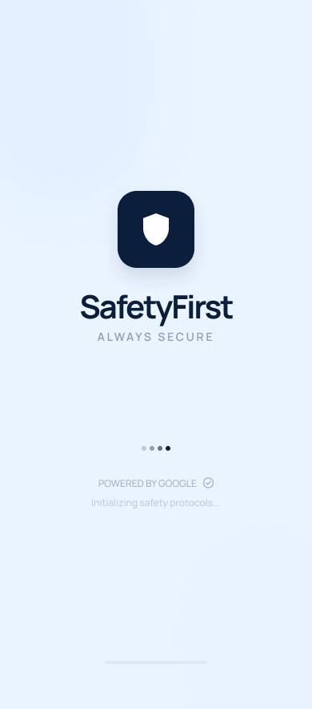
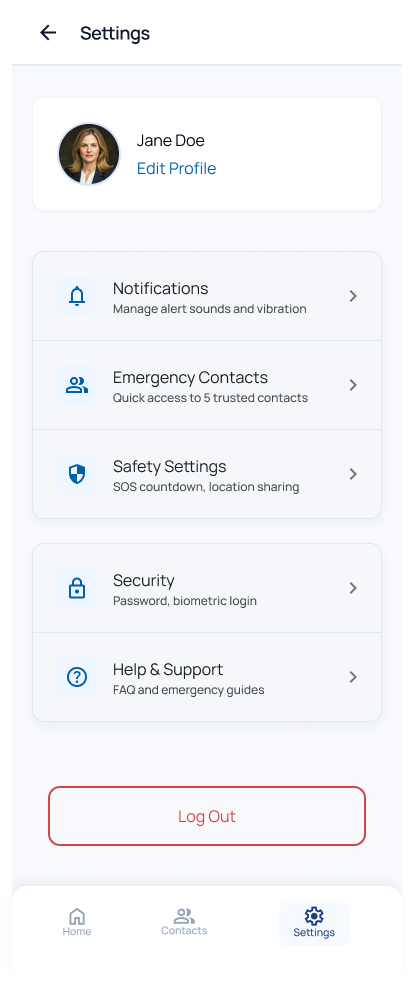

# Ben İyiyim - Emergency Communication App

Ben İyiyim (I'm Fine) is a crucial emergency communication application built with Flutter, designed to facilitate rapid communication during earthquakes and natural disasters. The app allows users to quickly notify their predefined contacts about their safety status with a single tap, bypassing congested networks and keeping loved ones informed during crises.

## 📱 Screenshots

<div align="center">
  
  
  
  
  
  
  
  
  
</div>

## 🚀 Features

- **Quick Status Updates**: Instantly broadcast your safety status to all registered emergency contacts.
- **Contact Management**: Keep a prioritized list of loved ones to notify during an emergency.
- **Real-Time Sync**: Uses Firebase Firestore to keep contact lists and statuses updated in real-time.
- **Clean Architecture**: Built with strict adherence to Feature-Based Clean Architecture (Presentation, Domain, Data layers).
- **Offline Capabilities**: Queues updates if the network drops and syncs immediately when connectivity is restored.

## 🛠️ Tech Stack & Architecture

This project strictly follows modern scalable application practices:

- **Framework**: Flutter (SDK >=3.0.0 <4.0.0)
- **State Management**: `flutter_bloc`
- **Backend Services**: Firebase Core, Auth, Firestore, Messaging, Analytics, Crashlytics, and Storage.
- **Routing**: `go_router`
- **Dependency Injection**: `get_it`
- **Functional Programming**: `dartz` (Either types for robust error handling)
- **UI & Theming**: Google Fonts, Lottie animations, Shimmer loading states, and strictly typed `ThemeData` extensions for colors, spacing, and typography.

## 📁 Project Structure

```text
lib/
├── core/
│   ├── constants/
│   ├── theme/
│   ├── extensions/
│   ├── services/
│   ├── utils/
│   └── errors/
│
├── shared/
│   ├── widgets/     # Reusable UI (buttons, cards, dialogs)
│   └── painters/
│
└── features/
    └── [feature_name] (e.g., contacts, auth)/
        ├── data/         # Models, repositories implementation, datasources
        ├── domain/       # Entities, use cases, repository interfaces
        └── presentation/ # Blocs, screens, widgets
```

## 🎨 UI/UX Philosophy

The app is built utilizing a heavily componentized design system. 
- **No Hardcoded Values**: Colors, spacing, and typography rely exclusively on strict theme extensions (`context.colors.primary`, `AppSpacing.md`).
- **Reusable Widgets**: All basic UI components (e.g., `AppButton`, `AppTextField`, `AppDialog`) are built as reusable `shared/widgets`.
- **Bloc-driven UI**: Complex business logic and state management are pushed entirely to Blocs, keeping the widget tree light and declarative.

## 🚀 Getting Started

### Prerequisites

- Flutter SDK (>=3.0.0)
- A connected device or emulator.
- Access to the Firebase project environment.

### Installation

1. **Get the dependencies:**
   ```bash
   flutter pub get
   ```

2. **Firebase Configuration:**
   Configure your Firebase environment using the FlutterFire CLI:
   ```bash
   flutterfire configure
   ```

3. **Run the application:**
   ```bash
   flutter run
   ```

---
*Stay Safe. Stay Connected.*
